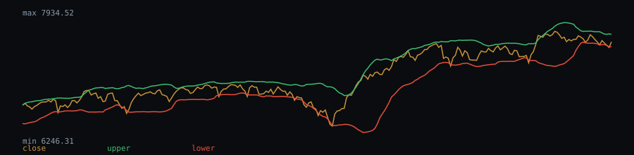

# Bollinger Bands(20,2) behaviour — eurusd-daily.csv

Bollinger Bands(20, 2σ) computed on the closing-price series (6926 valid bars).

- Closes outside the bands (above upper or below lower): 11.46%
- Theoretical figure for a **normal distribution** at ±2σ: **4.6%** (this is the textbook value under a
  normality assumption, not an observation from this sample — it is cited here only for comparison)

## Chart (last 250 bars)



## Dataset

- File: `data/eurusd-daily.csv`
- Provenance header:

```
# source: FRED, Federal Reserve Bank of St. Louis (US Dollars per Euro, noon buying rates NY)
# url: https://fred.stlouisfed.org/graph/fredgraph.csv?id=DEXUSEU
# downloaded_at: 2026-09-21
# license: Public domain (U.S. federal government work: Board of Governors of the Federal Reserve System / U.S. Energy Information Administration); cite FRED, Federal Reserve Bank of St. Louis, series DEXUSEU — https://fred.stlouisfed.org/legal/
```

- Library version: 0.1.0
- Reproduce: `npm run build && npm run evidence`

This describes how the indicator behaved on this sample; it is not a measure of profitability.
