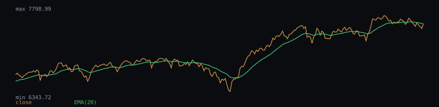

# EMA(20) behaviour — sp500-daily.csv

Close price vs. EMA(20) on the closing-price series (2494 valid bars).

- Bars with close above EMA(20): 70.33%
- Crossovers (close crossing EMA(20)): 290 total, 11.63 per 100 bars
- Median bars between crossovers: 3
- Mean run length of a "close above EMA(20)" regime: 12.1 bars (145 regimes observed)

## Chart (last 250 bars)



## Dataset

- File: `data/sp500-daily.csv`
- Provenance header:

```
# source: FRED, Federal Reserve Bank of St. Louis (S&P 500 index, daily close, last 10 years per S&P licence)
# url: https://fred.stlouisfed.org/graph/fredgraph.csv?id=SP500
# downloaded_at: 2026-09-21
# license: Free use with attribution; see https://fred.stlouisfed.org/legal/
```

- Library version: 0.1.0
- Reproduce: `npm run build && npm run evidence`

This describes how the indicator behaved on this sample; it is not a measure of profitability.
