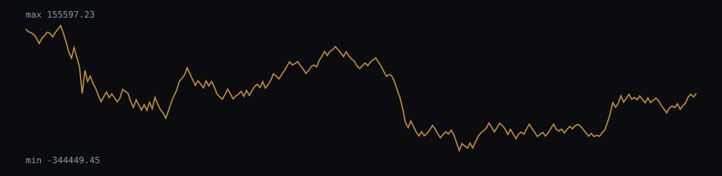

# OBV behaviour — btcusdt-1d.csv

_This indicator needs volume data, so it is evaluated on `btcusdt-1d.csv` only (the only OHLCV dataset with sufficient depth here)._

On-Balance Volume on 1000 bars.

- Pearson correlation between bar-to-bar OBV changes and bar-to-bar close changes: 0.77
  (OBV adds/subtracts the full bar volume on an up/down close, so a strong positive correlation with
  the direction of price change is expected by construction, not a predictive signal)

## Chart (last 250 bars)



## Dataset

- File: `data/btcusdt-1d.csv`
- Provenance header:

```
# source: Binance public market data (BTCUSDT 1d)
# url: https://data-api.binance.vision/api/v3/klines?symbol=BTCUSDT&interval=1d&limit=1000
# downloaded_at: 2026-09-21
# license: Public API; data provided as-is by Binance
```

- Library version: 0.1.0
- Reproduce: `npm run build && npm run evidence`

This describes how the indicator behaved on this sample; it is not a measure of profitability.
