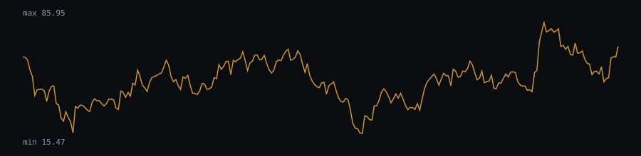

# RSI(14) behaviour — btcusdt-1d.csv

RSI(14) computed on the closing-price series (986 valid bars after the 14-bar warm-up).

- Bars with RSI > 70 (overbought zone): 8.72%
- Bars with RSI < 30 (oversold zone): 3.04%
- Mean run length of an "RSI > 70" regime: 4.3 bars (20 regimes observed)
- Mean run length of an "RSI < 30" regime: 3.33 bars (9 regimes observed)

### Histogram (10 buckets)

| RSI range | Bars | Share |
|---|---|---|
| 0-10 | 0 | 0% |
| 10-20 | 5 | 0.51% |
| 20-30 | 25 | 2.54% |
| 30-40 | 124 | 12.58% |
| 40-50 | 309 | 31.34% |
| 50-60 | 263 | 26.67% |
| 60-70 | 174 | 17.65% |
| 70-80 | 64 | 6.49% |
| 80-90 | 22 | 2.23% |
| 90-100 | 0 | 0% |

## Chart (last 250 bars)



## Dataset

- File: `data/btcusdt-1d.csv`
- Provenance header:

```
# source: Binance public market data (BTCUSDT 1d)
# url: https://data-api.binance.vision/api/v3/klines?symbol=BTCUSDT&interval=1d&limit=1000
# downloaded_at: 2026-09-21
# license: Public API; data provided as-is by Binance
```

- Library version: 0.1.0
- Reproduce: `npm run build && npm run evidence`

This describes how the indicator behaved on this sample; it is not a measure of profitability.
