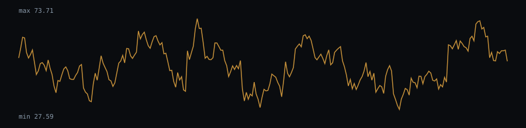

# RSI(14) behaviour — eurusd-daily.csv

RSI(14) computed on the closing-price series (6931 valid bars after the 14-bar warm-up).

- Bars with RSI > 70 (overbought zone): 6.26%
- Bars with RSI < 30 (oversold zone): 5.31%
- Mean run length of an "RSI > 70" regime: 4.09 bars (106 regimes observed)
- Mean run length of an "RSI < 30" regime: 3.96 bars (93 regimes observed)

### Histogram (10 buckets)

| RSI range | Bars | Share |
|---|---|---|
| 0-10 | 0 | 0% |
| 10-20 | 41 | 0.59% |
| 20-30 | 327 | 4.72% |
| 30-40 | 1143 | 16.49% |
| 40-50 | 1989 | 28.7% |
| 50-60 | 1875 | 27.05% |
| 60-70 | 1122 | 16.19% |
| 70-80 | 398 | 5.74% |
| 80-90 | 36 | 0.52% |
| 90-100 | 0 | 0% |

## Chart (last 250 bars)



## Dataset

- File: `data/eurusd-daily.csv`
- Provenance header:

```
# source: FRED, Federal Reserve Bank of St. Louis (US Dollars per Euro, noon buying rates NY)
# url: https://fred.stlouisfed.org/graph/fredgraph.csv?id=DEXUSEU
# downloaded_at: 2026-09-21
# license: Public domain (U.S. federal government work: Board of Governors of the Federal Reserve System / U.S. Energy Information Administration); cite FRED, Federal Reserve Bank of St. Louis, series DEXUSEU — https://fred.stlouisfed.org/legal/
```

- Library version: 0.1.0
- Reproduce: `npm run build && npm run evidence`

This describes how the indicator behaved on this sample; it is not a measure of profitability.
