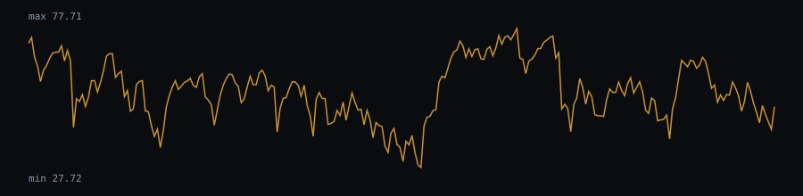

# RSI(14) behaviour — sp500-daily.csv

RSI(14) computed on the closing-price series (2499 valid bars after the 14-bar warm-up).

- Bars with RSI > 70 (overbought zone): 9.56%
- Bars with RSI < 30 (oversold zone): 1.64%
- Mean run length of an "RSI > 70" regime: 3.46 bars (69 regimes observed)
- Mean run length of an "RSI < 30" regime: 1.86 bars (22 regimes observed)

### Histogram (10 buckets)

| RSI range | Bars | Share |
|---|---|---|
| 0-10 | 0 | 0% |
| 10-20 | 3 | 0.12% |
| 20-30 | 38 | 1.52% |
| 30-40 | 199 | 7.96% |
| 40-50 | 474 | 18.97% |
| 50-60 | 733 | 29.33% |
| 60-70 | 813 | 32.53% |
| 70-80 | 223 | 8.92% |
| 80-90 | 16 | 0.64% |
| 90-100 | 0 | 0% |

## Chart (last 250 bars)



## Dataset

- File: `data/sp500-daily.csv`
- Provenance header:

```
# source: FRED, Federal Reserve Bank of St. Louis (S&P 500 index, daily close, last 10 years per S&P licence)
# url: https://fred.stlouisfed.org/graph/fredgraph.csv?id=SP500
# downloaded_at: 2026-09-21
# license: Free use with attribution; see https://fred.stlouisfed.org/legal/
```

- Library version: 0.1.0
- Reproduce: `npm run build && npm run evidence`

This describes how the indicator behaved on this sample; it is not a measure of profitability.
