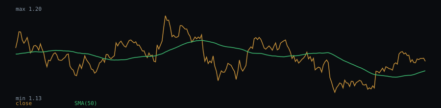

# SMA(50) behaviour — eurusd-daily.csv

Close price vs. SMA(50) on the closing-price series (6896 valid bars).

- Bars with close above SMA(50): 49.74%
- Crossovers (close crossing SMA(50)): 457 total, 6.63 per 100 bars
- Median bars between crossovers: 5
- Mean run length of a "close above SMA(50)" regime: 14.98 bars (229 regimes observed)

## Chart (last 250 bars)



## Dataset

- File: `data/eurusd-daily.csv`
- Provenance header:

```
# source: FRED, Federal Reserve Bank of St. Louis (US Dollars per Euro, noon buying rates NY)
# url: https://fred.stlouisfed.org/graph/fredgraph.csv?id=DEXUSEU
# downloaded_at: 2026-09-21
# license: Public domain (U.S. federal government work: Board of Governors of the Federal Reserve System / U.S. Energy Information Administration); cite FRED, Federal Reserve Bank of St. Louis, series DEXUSEU — https://fred.stlouisfed.org/legal/
```

- Library version: 0.1.0
- Reproduce: `npm run build && npm run evidence`

This describes how the indicator behaved on this sample; it is not a measure of profitability.
