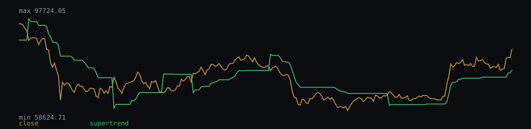

# SuperTrend behaviour — btcusdt-1d.csv

_This indicator needs open/high/low data, so it is evaluated on `btcusdt-1d.csv` only (the FRED series in this repo are close-only)._

SuperTrend default settings on 991 bars with an established trend.

- Trend flips: 28 total, 2.83 per 100 bars
- Median trend-segment duration: 25 bars

## Chart (last 250 bars)



## Dataset

- File: `data/btcusdt-1d.csv`
- Provenance header:

```
# source: Binance public market data (BTCUSDT 1d)
# url: https://data-api.binance.vision/api/v3/klines?symbol=BTCUSDT&interval=1d&limit=1000
# downloaded_at: 2026-09-21
# license: Public API; data provided as-is by Binance
```

- Library version: 0.1.0
- Reproduce: `npm run build && npm run evidence`

This describes how the indicator behaved on this sample; it is not a measure of profitability.
